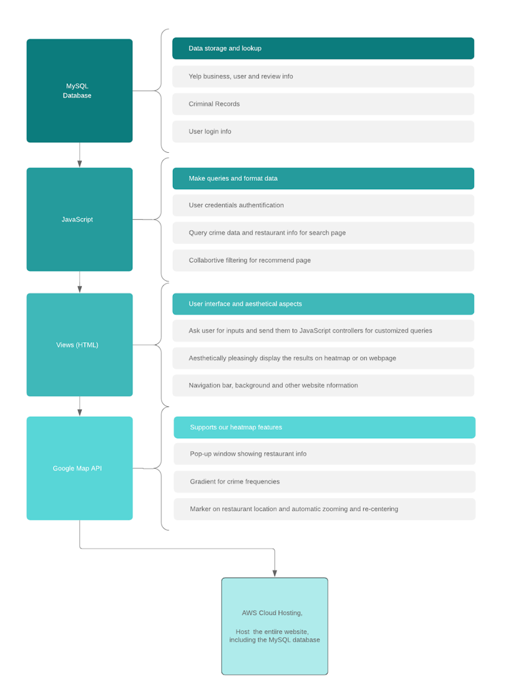

# **Eat Safe** 

Contributors:  Yucheng Ruan, Qiannan Guo, Daizhen Li, Yuting Tan 

### Project Goals

As frequent travelers, the four members in our team share the common experience of using Yelp to find places to eat when arriving in a new city. However, since we were unfamiliar with the city, sometimes we ended up in a shabby area that looked suspiciously risky. To ensure travelers and foodies that they would have a safe dining experience, we decided to build Eat Safe, a web app that integrates Yelp data and criminal records in major cities to indicate how likely they may encounter a crime in the vicinity of the restaurant they intend to go to. 

### Data Sources

**Yelp Open Dataset** (8.68GB) and **criminal records in Las Vegas** (20000 crime events )

### Framework

